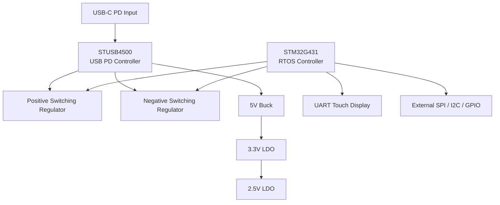
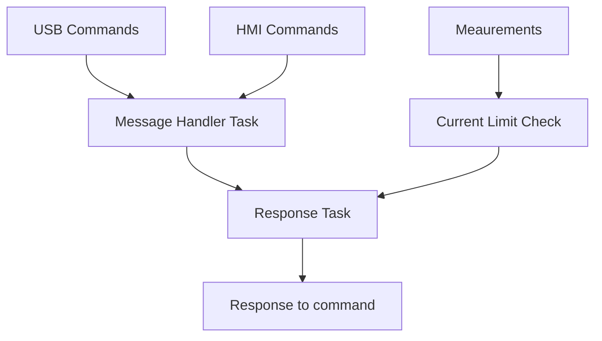
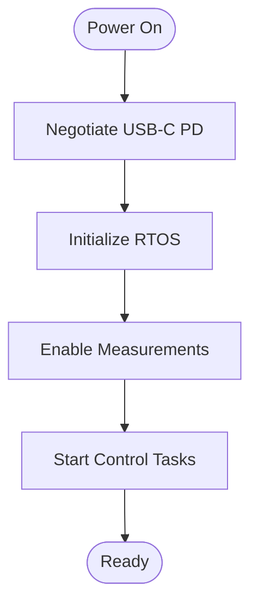

# USB-C Power Supply

> USB-C Power Delivery programmable power supply with dual adjustable rails, external interfaces, RTOS firmware, and touchscreen support.

---

## Project Status

🚧 **IN PROGRESS**

This project is currently under active development. Hardware, firmware, and interface functionality are operational, with documentation and validation still being expanded.

---

## Overview

This system is a programmable laboratory / embedded development power supply powered from a standard USB-C Power Delivery source.

The design negotiates power from a USB-C PD adapter and generates multiple regulated outputs including independently controlled positive and negative rails along with fixed auxiliary outputs.

Primary control methods include:

- USB Serial interface
- Touchscreen HMI interface
- External expansion header supporting SPI / I2C / GPIO control

The platform is intended for embedded development, analog experimentation, prototyping, and automated test applications where remotely configurable supplies are useful.

Supported outputs:

| Rail | Description |
|---|---|
| VP | Adjustable positive supply |
| VN | Adjustable negative supply |
| +5V | Fixed auxiliary output |
| +3.3V | Fixed auxiliary output |
| +2.5V | Fixed auxiliary output |

---

# System Overview Image

🚧 **IN PROGRESS**

---

# Hardware Architecture



---

# Hardware Blocks

| Block | Device |
|---|---|
| USB-C Power Delivery Controller | STUSB4500QTR |
| MCU | STM32G431RBT6 |
| Positive Regulator | TPS54302DDCR |
| Positive Rail Digital Potentiometer | AD5245BRJZ50-RL7 |
| Negative Regulator | MC34063EBD-TR |
| Negative Rail Digital Potentiometer | AD5292BRUZ-50-RL7 |
| 5V Regulator | AP63200WU-7 |
| 3.3V Regulator | LD39100PUR |
| 2.5V Regulator | ADP150AUJZ-2.5-R7 |

---

# Hardware Description

## USB-C Power Delivery

Device:

```text
STUSB4500QTR
```

Responsibilities:

- Negotiates USB-C PD contracts
- Requests higher input voltages during startup
- Default target: 20V input
- Configurable request voltage/current profiles

---

## MCU

Device:

```text
STM32G431RBT6
```

Responsibilities:

- RTOS scheduler
- Supply management
- Measurement acquisition
- USB command processing
- HMI interface
- Current limiting control
- External communications

---

## Positive Supply Rail

Components:

```text
TPS54302DDCR
AD5245BRJZ50-RL7
```

Features:

- Adjustable output voltage
- Digital control through firmware
- Voltage feedback tracking
- Current limiting support

Target range:

```text
0V → +20V (target)
```

---

## Negative Supply Rail

Components:

```text
MC34063EBD-TR
AD5292BRUZ-50-RL7
```

Features:

- Programmable negative output
- Independent regulation
- Current limiting support

Target range:

```text
0V → -20V (target)
```

---

## Auxiliary Rails

| Output | Regulator |
|---|---|
| +5V | AP63200WU-7 |
| +3.3V | LD39100PUR |
| +2.5V | ADP150AUJZ-2.5-R7 |

---

## External Interfaces

### Expansion Header

Provides:

- SPI
- I2C
- GPIO

Interface:

```text
10-pin expansion connector
```

---

### GPIO Header

Provides:

- GPIO
- +3.3V
- +5V
- GND

Interface:

```text
10-pin auxiliary header
```

---

### HMI Display

UART touchscreen connection:

| Signal |
|---|
| 5V |
| TX |
| RX |
| GND |

---

## Measurement System

Current implementation:

🚧 **IN PROGRESS**

| Type | Quantity |
|---|---|
| Voltage measurements | 7 |
| Current measurements | 4 |

---

# Firmware Architecture

🚧 **IN PROGRESS**

The firmware uses an RTOS architecture with independent tasks for communications, measurements, regulation, and interface handling.



---

## Startup Sequence

🚧 **IN PROGRESS**



---

## Major Functions

### USB Command Processing

🚧 **IN PROGRESS**

Flow:

```text
USB RX
   ↓
Parser
   ↓
Message Handler Task
   ↓
Command Execution
   ↓
USB Response
```

---

### HMI Processing

🚧 **IN PROGRESS**

Flow:

```text
UART RX
   ↓
Parser
   ↓
Message Handler
   ↓
Display Update
```

---

### Current Limiting

🚧 **IN PROGRESS**

The firmware continuously monitors output current and dynamically adjusts output voltage when limits are exceeded.

Control applies to:

- VP rail
- VN rail

Capabilities:

- Current monitoring
- Voltage throttling
- Adjustable limits
- Closed-loop protection

---

## Output Tracking

Firmware stores:

| Parameter |
|---|
| Requested voltage |
| Measured voltage |
| Requested current limit |
| Measured current |
| Enable state |

Tracked independently for:

```text
VP
VN
3V3
2V5
```

---

# USB Commands

Command table may expand in future revisions.

| Command | Arguments | Description |
|---|---|---|
| ID? | — | Return device ID |
| ERR? | — | Return error state |
| VSET | P / N | Set supply voltage |
| VGET | P / N / 3 / 2 | Get voltage |
| VEN | P / N / 3 / 2 | Enable rail |
| VDIS | P / N / 3 / 2 | Disable rail |
| VMEAS | P / N / 3 / 2 | Measurement mode |
| USBPD | V:I | Request PD contract |
| IGET | P / N / 3 / 2 | Get current |
| STACK | 0–5 | Task stack usage |
| ILIM | P / N / 3 / 2 | Set current limit |

---

# Build Instructions

## Clone Repository

```bash
git clone <repo_url>

cd USBC_PowerSupply
```

---

## Open Project

1. Launch STM32CubeIDE

2. Select:

```text
File → Open Projects From File System
```

3. Import repository directory

4. Allow CubeMX regeneration if prompted

---

## Build

Toolbar:

```text
Project → Build
```

or:

```bash
CTRL + B
```

---

## Flash Device

Connect:

```text
SWD
```

Programmer:

```text
ST-Link
```

Flash:

```text
Run → Debug
```

or

```text
Run → Run As → STM32 Cortex-M Application
```

---

# Pinout

🚧 **IN PROGRESS**

# Pinout

| MCU Pin | User Label | Function | Description |
|---|---|---|---|
| PC13 | TBD | GPIO | TBD |
| PC14 | TBD | GPIO | TBD |
| PC15 | TBD | GPIO | TBD |
| PH0 | TBD | OSC_IN | HSE Input |
| PH1 | TBD | OSC_OUT | HSE Output |
| NRST | RESET | RESET | System Reset |
| PA0 | TBD | GPIO / ADC | TBD |
| PA1 | TBD | GPIO / ADC | TBD |
| PA2 | TBD | GPIO / ADC / USART2_TX | TBD |
| PA3 | TBD | GPIO / ADC / USART2_RX | TBD |
| PA4 | TBD | GPIO / ADC / SPI1_NSS | TBD |
| PA5 | TBD | GPIO / ADC / SPI1_SCK | TBD |
| PA6 | TBD | GPIO / ADC / SPI1_MISO | TBD |
| PA7 | TBD | GPIO / ADC / SPI1_MOSI | TBD |
| PC4 | TBD | GPIO | TBD |
| PC5 | TBD | GPIO | TBD |
| PB0 | TBD | GPIO / ADC | TBD |
| PB1 | TBD | GPIO / ADC | TBD |
| PB2 | TBD | GPIO | TBD |
| PB10 | TBD | GPIO / I2C2_SCL | TBD |
| PB11 | TBD | GPIO / I2C2_SDA | TBD |
| VSS | GND | POWER | Ground |
| VDD | +3V3 | POWER | Supply |
| PB12 | TBD | GPIO / SPI2_NSS | TBD |
| PB13 | TBD | GPIO / SPI2_SCK | TBD |
| PB14 | TBD | GPIO / SPI2_MISO | TBD |
| PB15 | TBD | GPIO / SPI2_MOSI | TBD |
| PC6 | TBD | GPIO | TBD |
| PC7 | TBD | GPIO | TBD |
| PC8 | TBD | GPIO | TBD |
| PC9 | TBD | GPIO | TBD |
| PA8 | TBD | GPIO | TBD |
| PA9 | TBD | GPIO / USART1_TX | TBD |
| PA10 | TBD | GPIO / USART1_RX | TBD |
| PA11 | TBD | GPIO / USB_DM | TBD |
| PA12 | TBD | GPIO / USB_DP | TBD |
| PA13 | SWDIO | DEBUG | SWD Data |
| VSS | GND | POWER | Ground |
| VDD | +3V3 | POWER | Supply |
| PA14 | SWCLK | DEBUG | SWD Clock |
| PA15 | TBD | GPIO / SPI1_NSS | TBD |
| PC10 | TBD | GPIO | TBD |
| PC11 | TBD | GPIO | TBD |
| PC12 | TBD | GPIO | TBD |
| PD2 | TBD | GPIO | TBD |
| PB3 | TBD | GPIO / SPI1_SCK | TBD |
| PB4 | TBD | GPIO / SPI1_MISO | TBD |
| PB5 | TBD | GPIO / SPI1_MOSI | TBD |
| PB6 | TBD | GPIO / I2C1_SCL | TBD |
| PB7 | TBD | GPIO / I2C1_SDA | TBD |
| BOOT0 | BOOT | CONFIG | Boot Mode Select |
| PB8 | TBD | GPIO / I2C1_SCL | TBD |
| PB9 | TBD | GPIO / I2C1_SDA | TBD |
| VSS | GND | POWER | Ground |
| VDD | +3V3 | POWER | Supply |
| PA0 | TBD | GPIO / ADC1_IN1 | TBD |
| PA1 | TBD | GPIO / ADC1_IN2 | TBD |
| PA2 | TBD | GPIO / ADC1_IN3 | TBD |
| PA3 | TBD | GPIO / ADC1_IN4 | TBD |
| VREF+ | VREF | ANALOG | ADC Reference |
| VDDA | +3V3A | ANALOG | Analog Supply |
| VSSA | AGND | ANALOG | Analog Ground |

---

# Images / Screenshots

🚧 **IN PROGRESS**

---

# Results

🚧 **IN PROGRESS**

---

# Future Work

🚧 **IN PROGRESS**

| Status | Item |
|---|---|
| In Progress | Update ReadME |

---

# License

(TBD)
